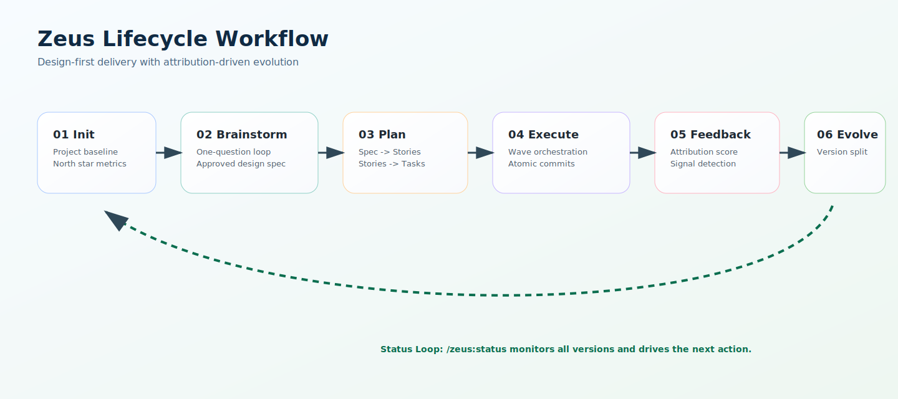
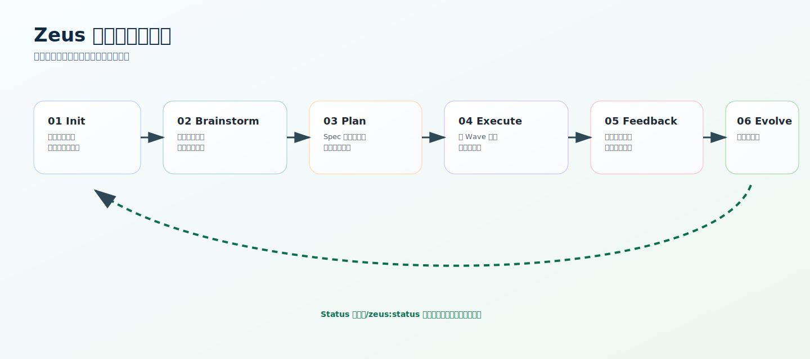

# Zeus - AI 项目演化操作系统

[](README.md)
[](#工作流)
[](#)
[](#许可证)

用于长期项目交付的结构化、版本化 AI 研发框架。

Zeus 核心能力：
- 可追踪的规划资产（`spec`、`prd`、`task`、`roadmap`）
- 基于依赖波次的执行与原子提交
- 从线上反馈到版本演化的强制归因闭环

语言切换：[English](README.md) | [简体中文](README.zh-CN.md)

## 快速开始

```bash
# 1) 安装 commit-msg hook（一次）
cp .zeus/hooks/commit-msg .git/hooks/commit-msg

# 2) 初始化 Zeus
/zeus:init

# 3) 首次全量设计
/zeus:brainstorm --full

# 4) 将 spec 转为执行资产
/zeus:plan

# 5) 按依赖波次执行任务
/zeus:execute
```

## 工作流

英文流程图：



中文流程图：



## Skill 命令

| 命令 | 用途 | 主要产物 |
|---|---|---|
| `/zeus:init` | 初始化 Zeus 工作区与北极星指标 | `.zeus/main/config.json`、`evolution.md` |
| `/zeus:brainstorm --full` | 全量设计对话与 spec 编写 | `.zeus/main/specs/*.md` |
| `/zeus:brainstorm --feature <name>` | 单功能设计循环 | feature spec |
| `/zeus:plan [--version v2]` | 将 spec 拆解为故事与任务 | `prd.json`、`task.json`、`roadmap.json` |
| `/zeus:execute [--version v2]` | 按 wave 执行未完成任务 | 原子提交、task pass 状态 |
| `/zeus:test-gen [--version v2] [--platforms android,chrome,ios]` | AI 生成平台测试流程文件 | `{version}/tests/*.test.json` |
| `/zeus:feedback` | 录入反馈并做归因分析 | `feedback/*.json`、演化记录 |
| `/zeus:evolve` | 创建新版本轨道 | `.zeus/vN/*` |
| `/zeus:status` | 输出全局状态与下一步建议 | 状态快照 + 推荐动作 |

## 目录结构

```text
.zeus/
  main/
    config.json
    prd.json
    task.json
    roadmap.json
    evolution.md
    feedback/
    ai-logs/
    specs/
    tests/
      android.test.json   ← AI 自动生成，不要手动编辑
      chrome.test.json
      ios.test.json
  v2/ ... vN/
  schemas/
    config.schema.json
    prd.schema.json
    task.schema.json
    roadmap.schema.json
    spec.schema.json
    feedback.schema.json
    ai-log.schema.json
    test-flow.schema.json
  scripts/
    zeus-runner.sh
    generate-tests.sh
    collect-metrics.sh
  hooks/
    commit-msg

.claude/
  skills/zeus-*/SKILL.md
  agents/*.md

assets/
  zeus-workflow.en.svg
  zeus-workflow.zh-CN.svg
```

## Agent 模型

Zeus 在 `.claude/agents` 下定义阶段化代理：

- `zeus-researcher`：上下文探索与依赖检查
- `zeus-planner`：spec 拆解与执行资产构建
- `zeus-executor`：wave 执行编排与质量门禁
- `zeus-analyst`：反馈归因与演化判定
- `zeus-docs`：双语文档一致性与可读性校验
- `zeus-tester`：AI 测试用例编写（android / chrome / ios）

推荐委派关系：
- brainstorming -> researcher
- plan -> planner
- execute -> executor
- 测试生成 -> tester（通过 `generate-tests.sh`）
- feedback/evolve -> analyst
- docs quality -> docs

## 测试

Zeus 使用 AI 自动生成测试流程。**不要手写测试用例。**

```bash
# 在 zeus:plan 之后为所有平台生成测试流程
bash .zeus/scripts/generate-tests.sh --version main --platforms android,chrome,ios

# 通过 skill 调用
/zeus:test-gen

# 仅生成指定平台
/zeus:test-gen --platforms chrome

# 强制重新生成（覆盖已有文件）
bash .zeus/scripts/generate-tests.sh --version main --force
```

生成的文件位于 `.zeus/{version}/tests/{platform}.test.json`，遵守 `.zeus/schemas/test-flow.schema.json` 结构规范。

测试执行直接使用各平台原生工具链：

| 平台 | 工具链 |
|---|---|
| Android | `adb shell` |
| Chrome | `chrome-cli` / Chrome DevTools Protocol |
| iOS | `xcrun simctl` / `libimobiledevice` |

`/zeus:plan` 完成后会自动询问是否生成测试；`/zeus:execute` 每个 wave 完成后也可选择刷新测试流程。

## AI 日志约定

每次 skill 执行必须在 `ai-logs/` 追加一条 markdown：

```markdown
## Decision Rationale
Why this approach was selected.

## Execution Summary
What changed and where.

## Target Impact
Expected impact on the north star metric.
```

## Commit 规范

```text
feat(T-003): implement user registration form
fix(T-007): correct session token expiry
docs(zeus): update prd from auth-design spec
chore(zeus): initialize v2 evolution
```

## 故障排查

- 若 `/zeus:*` 命令无法识别，请重启 AI 运行时会话。
- 若执行阶段卡住，检查 `.zeus/scripts/zeus-runner.sh` 是否可执行。
- 若任务更新失败，先校验 `.zeus/*/task.json` 的 JSON 格式。
- 若 commit hook 异常，重新复制 `.zeus/hooks/commit-msg` 到 `.git/hooks/`。

## 贡献指南

1. 提示词应保持可执行、可追踪、可审计。
2. shell 片段统一使用英文。
3. 保持 `.zeus` 核心 schema 向后兼容。
4. 工作流变化必须同步更新文档。

## 许可证

MIT License — 见 [LICENSE](LICENSE)。
